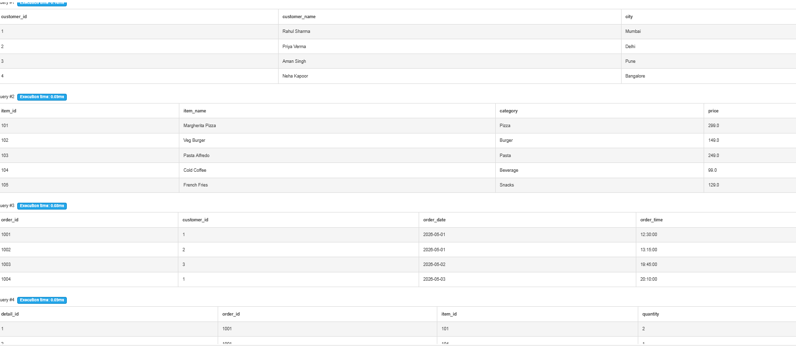
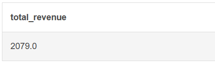
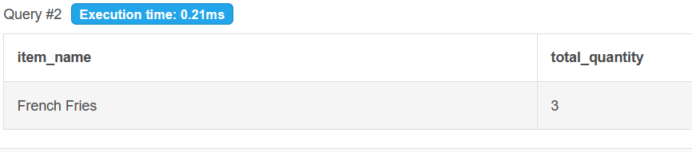

# 🍽️ Restaurant Order SQL Analysis

## 📌 Project Overview

This project analyzes restaurant order data using SQL.
It helps understand:

* Customer ordering behavior
* Revenue generation
* Best-selling menu items
* Daily sales trends
* Peak ordering hours

This project is beginner-friendly and ideal for:

* SQL Practice
* Data Analyst Portfolio
* College Mini Projects
* GitHub Projects

---

# 🛠️ Tech Stack

* SQL
* MySQL
* DB Fiddle

---

# 📂 Project Structure

```plaintext
restaurant-order-sql-analysis/
│
├── README.md
├── schema.sql
├── insert_data.sql
├── analysis_queries.sql
├── advanced_queries.sql
├── screenshots/
│   ├── tables_output.png
│   ├── revenue_analysis.png
│   ├── best_selling_item.png
│   └── top_customer.png
```

---

# 🗄️ Database Tables

The project contains 4 tables:

1. Customers
2. Menu
3. Orders
4. Order Details

---

# 🚀 How To Run

## Step 1

Run:

```sql
schema.sql
```

This creates all database tables.

---

## Step 2

Run:

```sql
insert_data.sql
```

This inserts sample restaurant data.

---

## Step 3

Run:

```sql
analysis_queries.sql
```

This performs:

* Revenue analysis
* Best-selling item analysis
* Daily sales report

---

## Step 4

Run:

```sql
advanced_queries.sql
```

This performs:

* Peak ordering hour analysis
* Customer spending analysis
* Average order value analysis

---

# 📊 SQL Concepts Used

* Joins
* Aggregate Functions
* GROUP BY
* ORDER BY
* Subqueries
* Revenue Analysis
* Business Insights

---

# 📸 Project Screenshots

## 1️⃣ Tables Output



---

## 2️⃣ Revenue Analysis



---

## 3️⃣ Best Selling Item



---

## 4️⃣ Top Spending Customer


---

# 📈 Key Insights

* Identified highest revenue-generating menu items
* Found top spending customers
* Analyzed daily revenue trends
* Detected peak ordering times
* Calculated average order value

---

# 💡 Future Improvements

You can improve this project by adding:

* Payment table
* Employee management
* Customer feedback system
* Online delivery analysis
* Power BI Dashboard
* Python integration

---

# 🎯 Skills Demonstrated

* SQL Query Writing
* Data Analysis
* Relational Database Design
* Business Analytics
* Problem Solving

---

# 👨‍💻 Author

Simi Dubey

---

# ⭐ GitHub Repository Description

```plaintext
Restaurant order analysis project using SQL joins, aggregations, revenue analysis, and customer insights.
```
